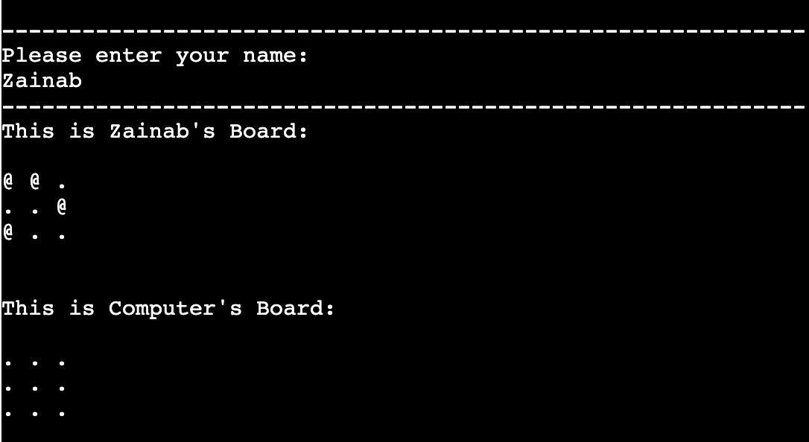
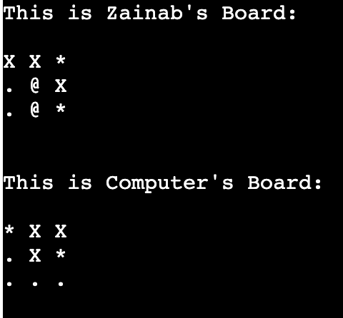
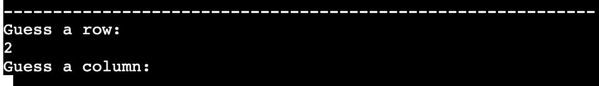
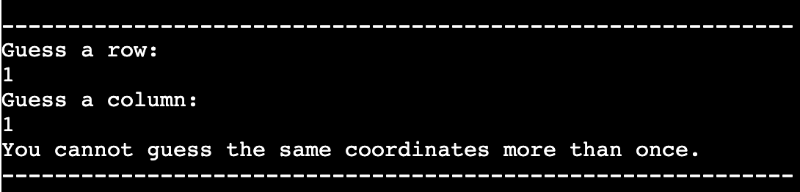
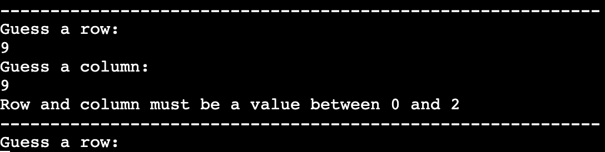
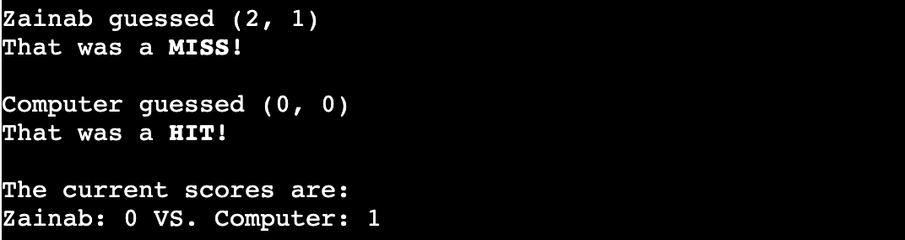
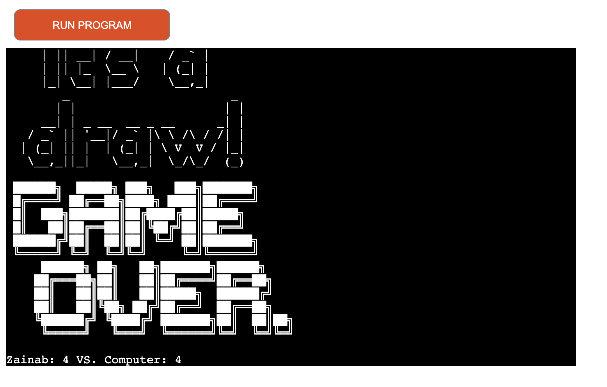
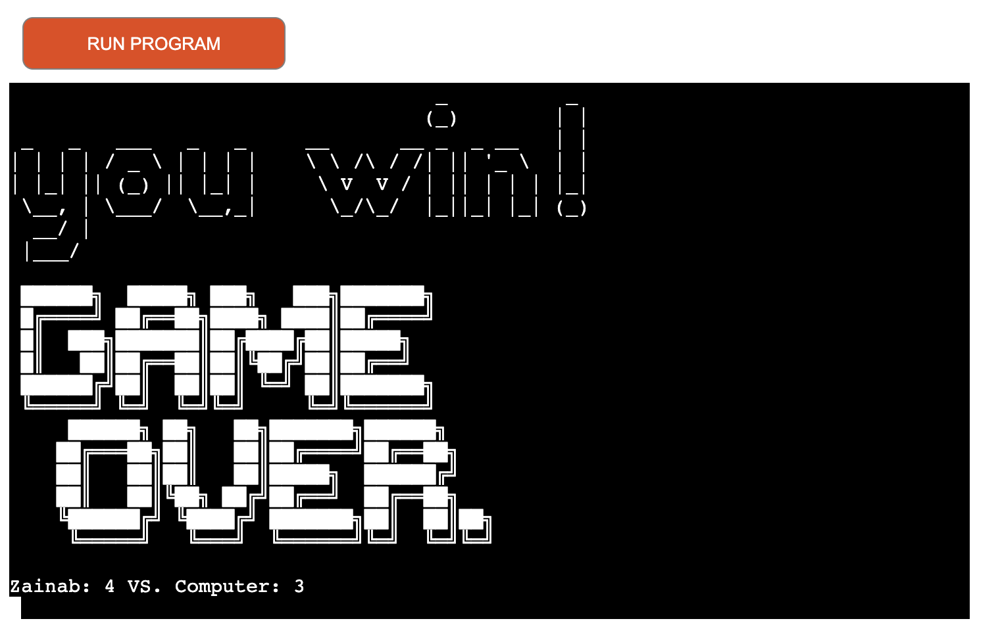
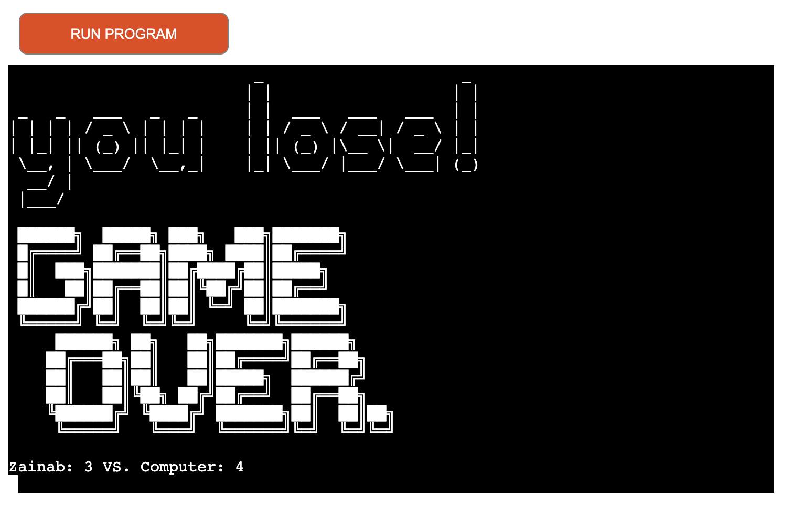
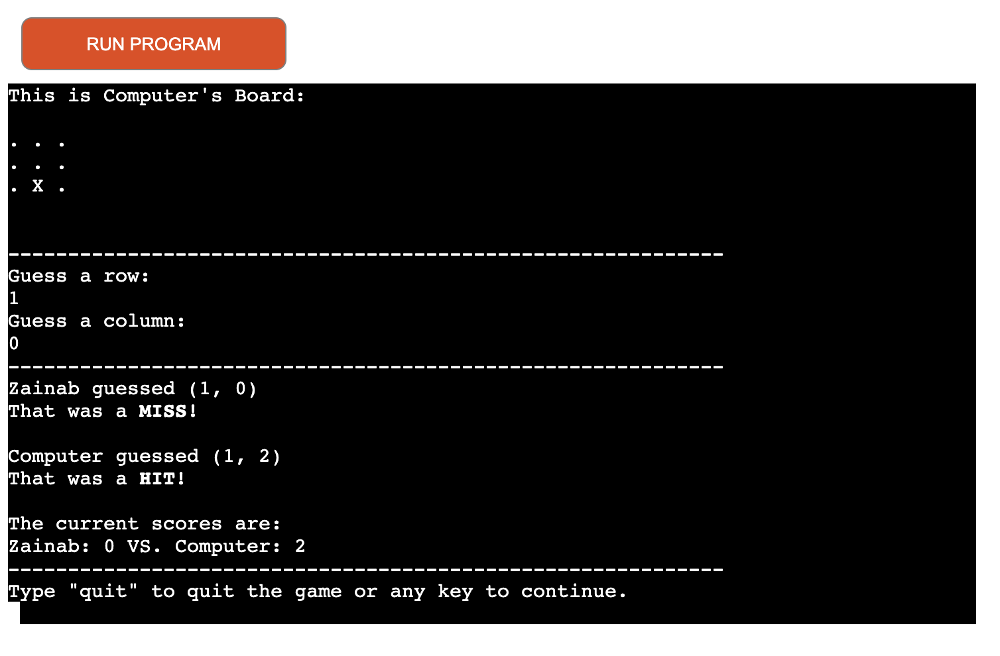

<h1><strong>Battleships</strong></h1>

<h2>Code Institute Milestone Project 3 -
Command-line application using python.</h2>

    The aim of the third project was to build a command-line application using python, that takes in
    input from the user and processes it. This website is made for educational purposes only. 

<a href="https://battleships-milestone-3.herokuapp.com/" target="_blank" >View the live website on Heroku.</a>

This image is produced using the tool from <a href="http://ami.responsivedesign.is/#" target="_blank">Am I Responsive</a>

This battleships application is a terminal based logical game. It is a widely known game played on grids where each player's ships are marked on the grid. The coordinates at which these ships are placed are conceled from the other player.
Hence the aim of the game is for players to call shots and make guesses at which coordinates the other player's ships are placed. The final objective is to destroy all the opponent's battleships. This game is designed as a single player game against a computer. The player has the choice of selecting the grid size that they would like. 
 

<h1><strong>Owner Stories</strong></h1>
<ol>
<li>As the owner, I want the game to be a function short fun game for users to interact with. </li>
<li>As the owner, I would like to make the game look appealing to the user.</li>
</ol>
<h1><strong>User Stories</strong></h1>
<ol>
<li>As a player, I would like the option to select the size of the board game grid.</li>
<li>As a new player, I would like some information on how to play the game.</li>
<li>As a new player, I would like some details as to what the symbols on the game board means.</li>
<li>As a player, I would like the option to quit the game at any stage.</li>
<li>As a New player, I would like the game to be clear and easy to navigate through.</li>
</ol>

<h2><strong>Skeleton</strong></h2>

include flowchart if u have time

<h1><strong>Features</strong></h1>

<li>At the start of the game, it requests for the user to input their name. It then uses the player's name to distinguis between the player's board and computer's board. It also uses the name to display the scores.</li>
 

 
<li>The two gameboards are displayed after each round. Each board is labelled to identify which player it belongs to. The user's ships are also displayed (as @) so the user is aware of where their ships have been randomly placed on their board. The placement of the computer's ships are hidden from the user.</li>
 

 
<li>The game asks tthe user to input the pair of coordinates sepeartley. It first asks for a row, and then column. As part of the in game validation, only numbers are accepted as an input.</li>
 

 
<li>As a validation check, the coordinates enetered by the user at each round is checked to make sure it is not a coordinate that has been previously entered and is being repeated. If this is the case, a message is displayed, and the user is again asked to input another pair of coordinates. This ensures that the user is not allowed to guess the same coordinates twice.</li>
 

 
<li>As another validation check, the coordinates enetered by the user at each round is also checked to make sure that it is valid within the range and size of the game board itself. This ensures that any coordinates guessed that are outside the grid size is not accepted. If this is not the case, a message is displayed to inform the user of the range of values they are able to guess from.</li>
 

 
<li>After each guess is entered, It displays what each game player has chosen as their guess for that round, and if it was a HIT or a MISS. It then outputs a tally of the current updated scores.</li>
 

<li>For aesthetic purposes when the game ends, a banner made up of ASCII codes are used to let the user know if they have won, lost or if it was a draw. It is then followed by GAME OVER to let the user know they have reached the end of the game. Below this, the final scores of the game are displayed to the user again.

 

<h1><strong>Features to Implement in the future:</strong></h1>
Some features that I would like to include in future releases are the following:
<ul>

<li>Add the option to save score and keep a record of past scores of previous games.</li>
<li>Allow the user to select the number of ships for the game.</li>
<li>Give the user the control to place their ships on their grid themselves.</li>
<li>Multiplayer Mode; Player Vs Player rather than Player Vs Computer</li>
</ul>

<h1><strong>Technologies Used</strong></h1>
This project is based on Python programming language. The technologies and tools that were used are listed below.
<ul>
<li><a href="https://www.gitpod.io/" target="_blank">GitPod</a> - Was the development environment used to write the code and build the project. Git commands were used to commit and push the code from gitpod to github. </li>
<li><a href="https://github.com/" target="_blank">GitHub</a> - Was the platform used to host the code that was written and pushed from GitPod into a repository. </li>
<li><a href="http://ami.responsivedesign.is/" target="_blank">Am I Responsive</a> - Was used to generate a repsonive image; displaying how the website would look on different devices. </li>
<li><a href="https://heroku.com/" target="_blank">Heroku</a> - Was used to deploy and host the project live in the cloud. </li>
<li><a href="http://pep8online.com/" target="_blank">pep8online</a> - Was used as a tool to validate the code and check for any errors and warnings within the code.</li>
<li><a href="https://docs.python.org/3/library/" target="_blank">Python Library (random)</a> - random.randint library was  used to generate random integer numbers for the opponent's (computer) coordinates in the battleships game. </li>
</ul>

<h1><strong>Testing</strong></h1>
<h2>Testing the User Stories</h2>
<ol>
<li>As a player, I would like the option to select the size of the board game grid.</li>
 
<ul>
<li>The landing page of the game includes a title banner, and below the game asks the user
to input the grid size of their choice. The game does not proceed until it recieves a valid integer input from the user.</li>
</ul>
 

 
 
<li>As a new player, I would like some information on how to play the game.</li>
 
<li>As a new player, I would like some details as to what the symbols on the game board means.</li>
 
<ul>
<li>Before the game officially begins a set of instructions are displayed to let the user know the game parameters (board size, number of ships) and instructions on how to play the game.</li>
<li> Underneath the instructions, a legend/key is displayed that shows what each symbol on the board game represents</li>
</ul>
 

 
 
<li>As a player, I would like the option to quit the game at any stage.</li>
 
<ul>
<li>Between each round, the game asks the user whether they would like to continue to the next round or quit the game. The game does not proceed until it recieves an input from the user. If the input is 'quit' the game will terminate. If the user does not wish to exit, then they will still have to press any key to continue onto the next round.</li>
</ul>
 

 
 
<li>As a New player, I would like the game to be clear and easy to navigate through.</li>
 
<ul>
<li>The overall layout of the game is neatly structured and labelled. Both gameboards are labelled to differentiate between the player and computer. There also is dashed lines to seperate the user entering their guess, and the result of their guess.</li>
</ul>
 

 
 
</ol>

<h2>PEP8 Code Validator Test</h2>
The code was passed into the following Python code validator tool <a href="http://pep8online.com/" target="_blank">PEP8 Online</a> The results obtained are shown iin the screenshot below. No errors or warnings were found in the code.
 
 

 
 
<h1><strong>Deployment</strong></h1>
This project was deployed using the code institute mock terminal along with Heroku. Throughout the project, 
the code was commited to git and pushed onto GitHub using git commands.
 
<h2>Deploy on to Heroku -</h2>
The following steps were carried out in order to deploy this project to Heroku from its GitHub repository:
<ol>
<li>On the Heroku dashboard, 'Create a new app' was selected. </li>
<li>The app name was entered, and the region was selected as Europe.</li>
<li>Once the app has been created, the setting tab was selected.</li>
<li>In the settings, the 'Buildpacks' were set by selected 'Python" first, followed by 'Node.js'.
<li>Scrolling down in the settings, a <em>Config Var</em> was added with the key set to <strong>PORT</strong> and the value is <strong>8000</strong></li>
<li>Next, the Deploy menu was selected, and GitHub was chosen as the "Deployment method"</li>
<li>'Connect too Github' was selected, and the repository name was searched and chosen. 'Connect' was then clicked to link the Github project repositry code to the Heroku app.</li>
<li>Scrolling down, 'Enable Automatic Deploys" was chosen, and the 'Deploy Branch' was selected.</li>
<li>After waiting a few moments for the app to build, a 'view app' button appeared which takes you to the deployed app</li>

<a href="https://battleships-milestone-3.herokuapp.com/" target="_blank" >View the live deployed website on Heroku.</a>

</ol>
<h2>Clone the website -</h2>
This will clone your working repository onto a local version. This is useful to backup work and can be done by:
<ol>
<li>Selecting the repository from GitHub.</li>
<li>Clicking on the green <strong>'code'</strong> button.</li>
<li>Copy the URL link provided by the drop-down.</li>
<li>Next open GitPod and change the current working directory into the directory location you are wanting to create the clone in.</li>
<li>Type <strong>'git clone'</strong> in the terminal, and past the URL link from step 3. </li>
<li>Finally press enter and a local clone will be created at the selected location</li>
</ol>

<h1><strong>Credits</strong></h1>
<ul>
    <li>The idea behind this project was inspired by code insitute's example idea #2 from their project portfolio 3 module.</li>
    <li>The following website <a href="https://patorjk.com/software/taag/#p=display&h=1&v=1&f=Doom&t=" target="_blank">
    [ Patorjk ] </a>was used to generate the ASCII codes for the text images that I used as title banners.</li>
    <li>The additional learning material and information I used throughtout this project include the following:
        <ul>
        <li><a href="https://stackoverflow.com/" target="_blank">
            Stack Overflow </a> </li>
        <li>Knowledge Mavens from <a href="https://youtube/tF1WRCrd_HQ" target="_blank">
            Youtube </a></li>
        <li><a href="https://docs.python.org/3/library/" target="_blank">
            The Python standard library </a></li>
        </ul>
    </li>

</ul>

<h1><strong>Acknowledgements</strong></h1>

I would like to extend my thanks to my course mentor Guido Cecilio for his feedback and guidance throughout the course of this project. His support and advice during our meetings helped me advance this project into the right direction. 